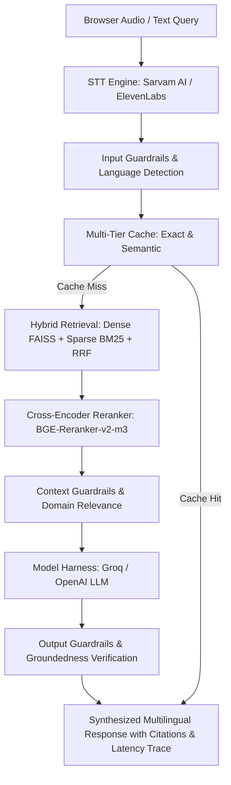

# 🎙️ Multilingual Voice-Enabled RAG System (AI4Bharat MSMARCO-XI)

[](https://fastapi.tiangolo.com)
[](https://python.org)
[](https://docker.com)
[](LICENSE)

An ultra-low latency, multilingual Voice Retrieval-Augmented Generation (RAG) system built on the **AI4Bharat MSMARCO-XI** dataset with end-to-end latency tracking, hybrid dense + sparse retrieval, cross-encoder reranking, guardrails, and caching.

---

## ⚡ Architecture Overview



---

## ✨ Key Features

- **🎙️ Voice & Text Interfaces**: Real-time microphone recording and audio transcription via Sarvam AI (Indic speech) or ElevenLabs Scribe.
- **⚡ Sub-200ms Latency Engine**: Multi-tiered Exact & Semantic caching with optimized hybrid retrieval and extractive synthesis.
- **🔍 Hybrid Retrieval & Reranking**: Reciprocal Rank Fusion (RRF) combining dense Sentence-Transformers embeddings (FAISS) + BM25 sparse search + BGE Cross-Encoder reranker.
- **🌐 10+ Indic Languages**: Full multilingual support for Hindi, Tamil, Telugu, Bengali, Marathi, Gujarati, Malayalam, Kannada, Punjabi, Odia, and English.
- **🛡️ Comprehensive Guardrails**: Pre-execution prompt injection & domain safety checks; post-execution groundedness & citation verification.
- **📊 Real-time Analytics**: Built-in latency breakdown (P50/P70/P100), SLA compliance tracking, and chunking strategy comparisons.

---

## 🚀 Quickstart (Local)

### 1. Clone & Install Dependencies
```bash
git clone https://github.com/GSdevX07/HHGoa_Task_2.git
cd HHGoa_Task_2

# Install dependencies
pip install -r requirements.txt
```

### 2. Configure Environment Secrets
Create a `.env` file or copy from `backend/.env.example`:
```bash
cp backend/.env.example backend/.env
```
Fill in your API keys:
```ini
GROQ_API_KEY=your_groq_api_key_here
SARVAM_API_KEY=your_sarvam_api_key_here
STT_PROVIDER=sarvam
```

### 3. Run the Server
```bash
uvicorn backend.main:app --port 8000 --reload
```
Open [http://localhost:8000](http://localhost:8000) in your browser.

---

## 🌐 Deploy Online

The application includes turnkey deployment configurations for all major cloud providers:

- **Hugging Face Spaces** (`Dockerfile` with 16GB free RAM)
- **Render.com** (`render.yaml` Blueprint)
- **Railway.app** (`railway.json` / `Dockerfile`)
- **Fly.io** (`fly.toml`)
- **Docker Compose** (`docker-compose.yml`)

👉 **See the complete [DEPLOYMENT.md](DEPLOYMENT.md) for step-by-step instructions.**

### Deploy with Docker:
```bash
docker compose up --build -d
```

---

## 📡 API Endpoints

| Method | Endpoint | Description |
| :--- | :--- | :--- |
| `GET` | `/` | Web UI Console |
| `GET` | `/api/health` | Health check & system diagnostics |
| `POST` | `/api/query/text` | Full RAG pipeline for text queries |
| `POST` | `/api/query/voice` | Voice RAG (multipart audio upload) |
| `GET` | `/api/dataset/samples` | Sample documents from MSMARCO-XI |
| `GET` | `/api/retrieval/info` | Status of dense/sparse/reranker engines |
| `POST` | `/api/chunking/compare` | Evaluate chunking strategies |
| `POST` | `/api/benchmark/run` | Trigger live latency benchmark |
| `GET` | `/docs` | Interactive Swagger API documentation |
